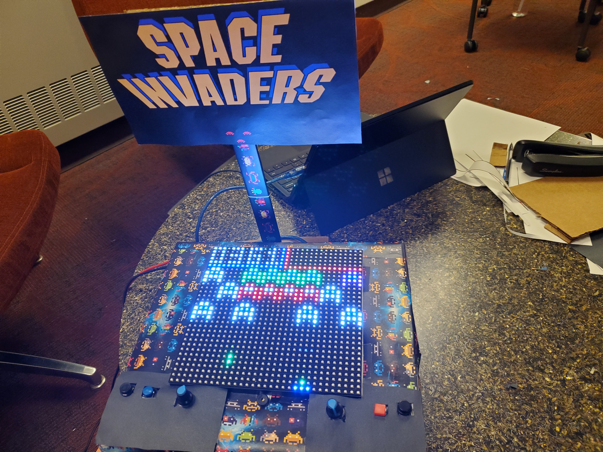

# Arduino Space Invaders
This project resulted in a custom Arduino powered space invaders game. A Master processor was made out of an Arduino MEGA which ran calculations and sent commands to the smaller Arduino UNO’s via UART (Universal Asynchronous Receiver/Transmitter). Two 16×32 LED boards were used and powered by Arduino Uno’s which processed the graphics in a such a way to effectively double the screen size. Other electrical components included potentiometers for movement, buttons for actions, a piezo buzzer for sound, and breadboard with jumper wires for wiring. Featuring singleplayer, multiplayer, pvp, powerups, and easter eggs, our version of the game had 25 custom levels followed by randomly generated waves. Our team ended up winning the Grand Prize at the EECS-183 2019 showcase.

Created as part of a project for a programming class by the Arduinerds: Robert, Sam, Ammar, and Myself.

## Watch the promo video <a href="https://www.youtube.com/watch?v=hnEeR7Wohws" target="_blank">here</a>!

